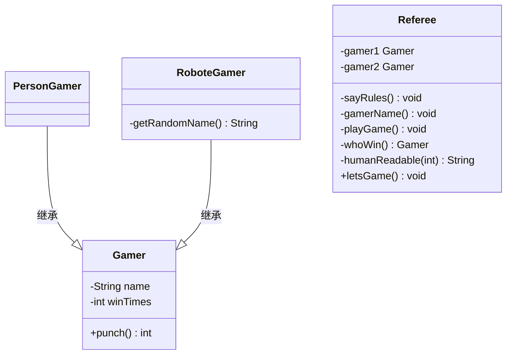

# Java基础

## 初识Java

- Java发展史
  - 1995年诞生
  - Java1.2开始分三个平台JavaEE、JavaSE、JavaME
  - Java1.5开始了很多新特性，自动装箱、泛型、反射、增强for等。
  - Java1.7对switch支持字符串
  - Java1.8加入Lambda表达式（我们使用的版本）
- Java工作原理
  
- 
- Java环境介绍
  - 可以分为开发环境JDK和运行环境JRE
  - JDK=JRE+API和开发工具
  - 开发使用JDK
  - JDK8下载地址**【注意系统版本】** [官网下载](https://www.oracle.com/java/technologies/javase/javase-jdk8-downloads.html) [本地下载](https://www.lanqiao.cn/courses/3376/learning/?id=73870)


- JDK环境配置

  | **变量名** | **说明**                                                     |
  | ---------- | ------------------------------------------------------------ |
  | JAVA_HOME  | JDK安装路径，如：C:\jdk1.8                                   |
  | PATH       | Windows系统执行命令要搜索的路径,如：%JAVA_HOME%\bin;（放在最前面） |
  | CLASSPATH  | 编译和运行要找的class路径,如：.;%JAVA_HOME%\lib（其中.代表当前路径） |

  **注意：Win10以前系统不要删除原有的path，而是在原有path值之前添加**。如下所示：

  ```
  %JAVA_HOME%\bin;\*************
  ```

  测试是否配置成功：win+R弹出运行窗口，输入cmd进入DOS命令，然后输入：

  ```
  java -version
  ```

  

- 第一个Java程序：Hello World！

## 数据类型和运算符

###  知识要点

本章开始学习Java的语法。首先学习最基础的变量、数据类型和表达式。主要包括以下知识点：

- 标识符和关键字
- 变量和常量
- Java数据类型
- 成员变量和局部变量
- Java运算符
- Java表达式


### 授课笔记

- 标识符和关键字

  - 标识符：在Java中需要用户自定义的符号称之为标识符。标识符由字母、数字、_、$组成，其中首字符不能是数字，不能为java关键字，标识符无长度限制，并且大小写敏感。
  - 标识符包括以下分类：
    - 变量和方法：第一个单词小写字母开头，后面单词首字母大写（骆驼命名）
    - 类名：第一个单词也大写，单词缩写需每个单词都大写
    - 包：都小写
    - 常量：都大写，且指出该常量完整的意义
  - 关键字：Java的保留字符，每个字符都有特定的含义，字母都小写。例如：public等

- 变量和常量

  - 变量：在程序运行时值可变的标识符。在内存中是一段有名字的连续存储空间 type varName[=value];
  - 常量：在程序运行时值不可以改变的标识符。使用final关键字，声明时必须初始化，不能重新赋值 final int STU_AGE=22;

- Java数据类型：

  - 基本数据类型

    - 数值型

      - 整数类型(byte,short,int,long）

      - 浮点类型(float,double)

        ```java
        long l = 9999999999999L; // 整形 int ， 浮点型 double
        long l1 = 999;
        float f = 3.14F;
        double d = 3.14;
        ```

    - 字符型(char) ：两个字节存储单个字符，\t \n(换行符) \r(回车符) \b

    - 布尔型(boolean)：值为true和false，不能是0和1。

  - 引用数据类型

    - 类(Class）
    - 接口(Interface）
    - 数组(Array）
    - 等...

- Java数据类型转换 

- 成员变量和局部变量

  - 成员变量：类中方法外的变量，也称全局变量。系统会赋默认值。
  - 局部变量：方法中的变量，声明时最好赋初始值否则开发时可能会出错误。

- Java运算符

  - 算术运算符：+， -，*， \，%， ++， --
  - 关系运算符：>，<，>=，<=，==，!=
  - 赋值运算符： =，+=，-=，*=，/=
  - 逻辑运算符：!，&&，||
  - 位运算符： ~ ，&，|，^，>>，<<，>>>

- Java表达式

  - 可以分为开发环境JDK和运行环境JRE
  - 表达式优先级


## String


## 数组

- 开关
  - for 中 有 if…else -> for 中用 Boolean

## 类和对象

### 知识要点

- 面向过程和面向对象
- 类和对象的概念
- 方法和属性
- 封装
- 构造方法
- this关键字
- 初始化块
- 方法重载


### 授课笔记

- 面向过程和面向对象
  - 面向过程思想 **步骤** -> 流程图
  - 面向对象思想 **四个找** -> 类图
  - 面向对象三大特征/四大特征
    - 继承
    - 封装
    - 多态
    - 抽象
- 类和对象的概念
  - **万物皆对象** - Java
  - 对象都由**特征**和**行为**组成。
  - 具有相同特征和行为的对象**抽象**成**类**
  - 对象是真实存在的；类是概念，不真实存在。
  - 类由属性（特征）和方法（行为）组成
- 方法和属性
  - 方法描述类的行为，命名一般是动词，由方法三要素组成。
  - 属性是类的特征或者组成，特征一般是基本类型或者String，组成一般是另一个类。
  - 属性类里表现的全局变量。
- 类之间的关系
  - 关联：对于两个相对独立的对象，当一个对象的实例与另一个对象的一些特定实例存在固定的对应关系时，这两个对象之间为关联关系。
  - 依赖：对于两个相对独立的对象，当一个对象负责构造另一个对象的实例，或者依赖另一个对象的服务时，这两个对象之间主要体现为依赖关系
  - 聚合：表示一种弱的‘拥有’关系，即has-a的关系，体现的是A对象可以包含B对象，但B对象不是A对象的一部分。 **两个对象具有各自的生命周期**。
  - 组合：组合是一种强的‘拥有’关系，是一种contains-a的关系，体现了严格的部分和整体关系，**部分和整体的生命周期一样**。
  - 实现：实现接口。
  - 泛化：继承关系。


- 封装
  - 作用：提高程序的数据安全性。
  - 操作：属性私有化，提供公共的getter/setter方法访问私有属性。
  - 数据安全：数据校验、数据访问。
- 构造方法
  - 作用：完成属性数据初始化操作。
  - 时间：对象实例化的时候被调用。
  - 存在：若用户不定义，系统会自动生成一个无参的空的构造方法。
  - 特点：1、方法名和类名相同。2、没有返回值类型。
- this&super关键字
  - this 类本身。
  - super 父类。
- 初始化块
  - 作用：将构造方法中具有相同功能的代码抽象成的代码块。
  - 本质：编译后，初始化块中的代码会被copy到构造方法中。初始化块消失。
  - 优点：便于代码维护和扩展。
  - 时间：先于构造方法执行。
  - 属性值：默认值 -> 初始化块值 -> 构造方法值 -> setter方法
- 方法重载
  - 同一个类中，方法名相同，参数不同（个数不同|类型不同|顺序不同），返回类型和权限无关的方法。
- 类的组成
  - 属性（成员变量）
  - 初始化块
  - 构造方法
  - 成员方法
  - getter&setter方法

## 继承与多态



